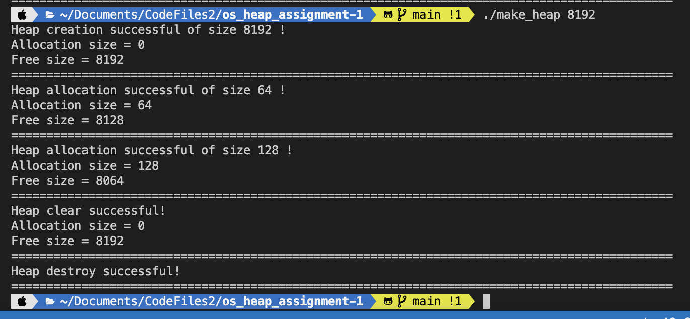
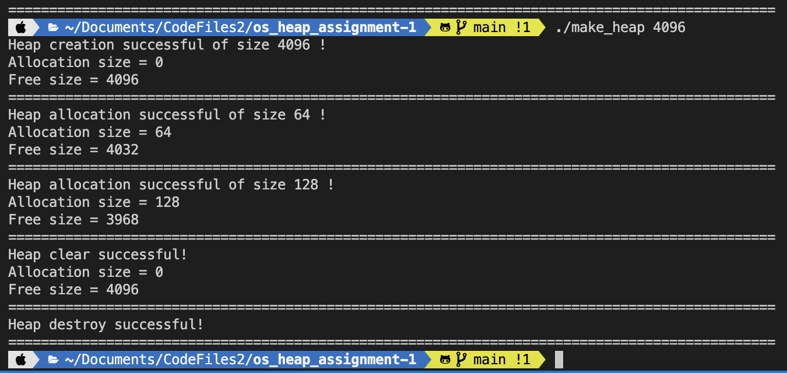

# OS_heap_size_assignment

To run
```
git clone https://github.com/surajchoubey/OS_heap_size_assignment
cd OS_heap_size_assignment
make
./make_heap 8192
./make_heap 4096
./make_heap 4093
```

## on 8192 bytes



## on 4096 bytes



## on 4093 bytes


